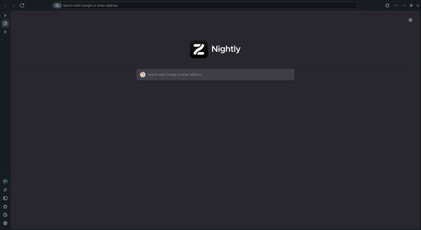

# Themis

[](https://themis.kauefraga.dev)
[](https://github.com/kauefraga/themis/blob/main/LICENSE)
[](https://github.com/kauefraga/themis)

> Um analisador de perfis do Bluesky, focado em usabilidade. Quer melhorar o seu perfil do Bluesky? O Themis vai te ajudar!

<div align="center">



</div>

O usuário insere o @ de um perfil e é redirecionado para a página de análise do mesmo, onde os dados do perfil inserido são processados e uma avaliação é gerada.

O objetivo do Themis é ser divertido e mostrar que existem alguns pontos que tornam um perfil mais atrativo no Bluesky.

Esse projeto é inspirado no [auralized.com](https://www.auralized.com/), um analisador de "aura" para perfis do Twitter/X. A ideia original era que fosse uma versão brasileira do projeto *auralized* para o Bluesky.

## Como usar

1. Entre no site [themis.kauefraga.dev](https://themis.kauefraga.dev)
2. Insira o @ do perfil (exemplo: meuarroba.bsky.social)
3. Clique na seta ou pressione a tecla <kbd>enter</kbd>

Depois disso você deve ser redirecionado para página de análise do perfil e pronto! Bem simples, né?

## Mais detalhes do projeto

O usuário insere o @ de um perfil (`handle`) e é redirecionado para a página de análise do mesmo, onde os dados do perfil inserido são processados e uma avaliação é gerada.

A **página inicial** é onde o usuário insere o `handle` do perfil por meio do formulário e é redirecionado para a página de análise.

Na **página de análise** (server component, server-side rendered), os dados do perfil são consultados utilizando a [API do Bluesky](https://docs.bsky.app/) (especificamente, o lexicon [`app.bsky.actor.getProfile`](https://docs.bsky.app/docs/api/app-bsky-actor-get-profile)) pelo [SDK](https://www.npmjs.com/package/@atproto/api) e consumidos na geração da avaliação do perfil, o feedback é gerado nessa etapa também.

### Como executar o ambiente de desenvolvimento

Primeiro, instale as dependências do projeto (requer o [Bun](https://bun.sh/))

```sh
bun install --frozen-lockfile
```

Execute o servidor de desenvolvimento do [Next.js](https://nextjs.org/docs)

```sh
bun dev # ou bun run dev
```

### Tecnologias

- [Bun](https://bun.sh/)
- [TypeScript](https://www.typescriptlang.org/)
- [Next.js](https://nextjs.org/)
- [Tailwind CSS](https://tailwindcss.com/)
- [ATProto API](https://www.npmjs.com/package/@atproto/api)
- [Lucide](https://lucide.dev/) / [lucide-react](https://lucide.dev/guide/packages/lucide-react)
- [Cloudflare Pages](https://pages.cloudflare.com/) / [Next.js SSR deploy](https://developers.cloudflare.com/pages/framework-guides/nextjs/ssr/get-started/)

## Contribuições

Fique à vontade para contribuir [abrindo uma issue](https://github.com/kauefraga/themis/issues/new) para reportar um bug, sugerir uma alteração na interface, uma melhoria ou uma nova funcionalidade.

### Como contribuir

1. Faça um *fork* do projeto
2. Clone seu *fork* na sua máquina
3. Prepare o [ambiente de desenvolvimento](#como-executar-o-ambiente-de-desenvolvimento)
4. Faça as alterações e *commit* elas com [mensagens descritivas](https://www.conventionalcommits.org/pt-br/v1.0.0/)
5. Sincronize as alterações com o repositório do seu *fork* (`git push`)
6. Abra um *pull request* especificando o que você fez de forma geral (considerando que as alterações têm seus *commits* descritivos)

### Contribuidores e apoiadores

Meus agradecimentos a essas pessoas incríveis por ajudarem a aprimorar o projeto ou por incentivarem a continuação do projeto por meio de doações:

[](https://github.com/gxolivei)
[](https://github.com/rdenadai)
[](https://github.com/andressansantos)
[](https://github.com/jeffque)
[](https://github.com/CaioHVectorA)
[](https://github.com/ibryans)

## Licença

Este projeto está sob a licença MIT - Veja a [LICENÇA](LICENSE) para mais informações.

---

Se você gostou do projeto, considere dar uma estrela no repositório ⭐, fazer [uma doação para eu tomar um cafézinho](https://www.pixme.bio/kauefraga) ☕ ou publicar a análise do seu perfil no [Bluesky](https://bsky.app/) 💙
